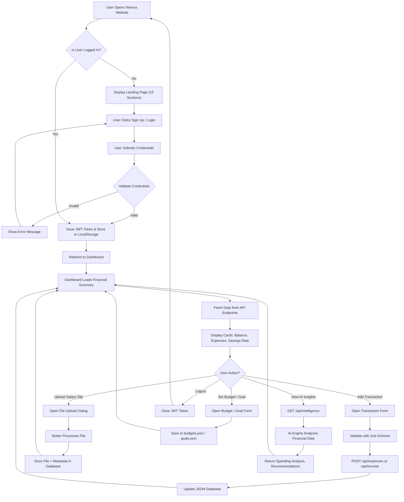
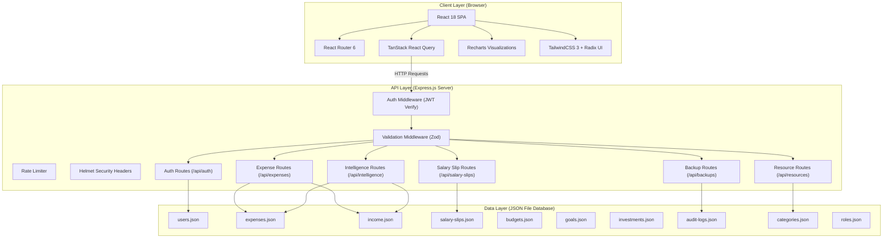

# Nexora – Intelligent Salary & Expense Management System

> **A Full-Stack Web Application for Personal Finance Management with AI-Powered Intelligence**
>
> **College Project Report** | Department of Computer Science & Engineering

---

## Table of Contents

1. [Introduction](#1-introduction)
2. [Problem Statement](#2-problem-statement)
3. [Objectives](#3-objectives)
4. [Proposed Solution](#4-proposed-solution)
5. [Scope of the Project](#5-scope-of-the-project)
6. [Use Case Diagram](#6-use-case-diagram)
7. [Workflow Diagram](#7-workflow-diagram)
8. [System Architecture](#8-system-architecture)
9. [Tools & Technologies Used](#9-tools--technologies-used)
10. [Modules Description](#10-modules-description)
11. [Expected Outcomes](#11-expected-outcomes)
12. [References](#12-references)

---

## 1. Introduction

In the modern economic landscape, personal financial management has become a critical life skill that directly impacts
an individual's quality of life, long-term savings, and financial security. With the rising cost of living, fluctuating
incomes, and increasingly complex financial obligations such as loans, investments, taxes, and insurance premiums,
individuals often struggle to maintain a clear and accurate picture of their financial health. Traditional methods of
financial tracking — such as manual spreadsheets, handwritten registers, or basic calculator-based arithmetic — are not
only tedious and error-prone but also fail to provide any meaningful analytical insights or predictive recommendations.

**Nexora** is an intelligent, full-stack web application designed to address these challenges comprehensively. It serves
as a centralized digital platform where users can track their salary income, manage daily expenses, upload and store
salary slips, set financial goals, plan budgets, monitor investments, and receive AI-powered financial health insights —
all within a single, beautifully designed, and highly responsive interface.

The application is built using a modern technology stack comprising **React 18** on the frontend, **Express.js** on the
backend, and a lightweight **JSON-based file database** for persistent storage. The entire system is developed in
**TypeScript** for end-to-end type safety, ensuring robustness, maintainability, and a reduced surface area for bugs.
The frontend utilizes **TailwindCSS 3** for styling, **Radix UI** for accessible component primitives, and **Recharts**
for interactive data visualizations. Authentication is handled via **JWT (JSON Web Tokens)** with **bcrypt** password
hashing, and the system is secured with **Helmet** headers and **rate limiting** middleware.

Nexora distinguishes itself from generic financial tools by offering an **AI-powered Financial Intelligence** module
that analyzes a user's income-to-expense ratio, spending patterns, and savings trajectory to generate actionable
recommendations. This transforms the application from a passive record-keeping tool into an active financial advisor.

The project is designed with a strong emphasis on **user experience (UX)** — featuring a premium, glassmorphic design
language, micro-interactions, smooth page transitions, and a fully responsive layout that works flawlessly across
desktop, tablet, and mobile devices. The landing page alone features 15 distinct, premium-quality UI sections that
communicate trust, clarity, and professionalism.

---

## 2. Problem Statement

Managing personal finances effectively remains a significant challenge for salaried individuals, freelancers, and
students. The key problems identified during the research phase of this project are:

1. **Lack of Centralized Tracking:** Most individuals use fragmented methods (bank SMS alerts, mental notes, scattered
   spreadsheets) to track their income and expenses, leading to an incomplete and often inaccurate financial picture.

2. **No Salary Slip Management:** Employees receive salary slips monthly but rarely store them in an organized,
   searchable, and retrievable format. When needed for tax filing, loan applications, or audit purposes, locating
   historical salary slips becomes extremely difficult.

3. **Absence of Budgeting Discipline:** Without automated budgeting tools, most individuals overspend in one or more
   categories (dining out, subscriptions, impulse shopping) without realizing it until the end of the month.

4. **No Financial Goal Tracking:** People often have vague financial goals ("save for a car," "build an emergency
   fund") but lack a structured system to define targets, track progress, and stay motivated.

5. **Poor Financial Health Awareness:** Most individuals do not know their savings rate, debt-to-income ratio, or
   whether their spending patterns are sustainable in the long term. There are no affordable tools that provide
   intelligent, personalized financial health insights.

6. **Security Concerns:** Many existing financial apps require users to share their bank credentials or connect
   directly to financial institutions, creating privacy and security risks. Users need a system that is fully
   self-hosted and does not transmit sensitive financial data to third-party servers.

7. **Complex Existing Solutions:** Enterprise-grade financial tools (Tally, QuickBooks) are designed for businesses
   and are overly complex, expensive, and inappropriate for individual personal use.

---

## 3. Objectives

The primary objectives of this project are:

1. To design and develop a **full-stack web application** that enables users to manage their salary income, daily
   expenses, budgets, financial goals, investments, and salary slips from a single unified dashboard.

2. To implement a **secure authentication system** using JWT tokens and bcrypt password hashing, ensuring that user
   financial data is protected against unauthorized access.

3. To build an **AI-powered Financial Intelligence** module that analyzes user data and provides personalized,
   actionable financial recommendations (e.g., "Reduce dining expenses by 15%" or "You're on track to meet your
   savings goal by December").

4. To provide **interactive data visualizations** using charts and graphs (bar charts, pie charts, progress bars) that
   give users an intuitive, at-a-glance understanding of their financial health.

5. To implement **salary slip upload and management** functionality, allowing users to store, view, and retrieve
   historical salary slips in an organized manner.

6. To create a **responsive, premium-quality user interface** that works seamlessly across desktop, tablet, and mobile
   devices, ensuring accessibility and usability for all users.

7. To ensure **data privacy** by using a local JSON-based database that stores all data on the server filesystem,
   eliminating the need for third-party cloud database services.

8. To implement **audit logging** for all critical operations (login, data modification, financial changes) to
   maintain a complete trail of system activity.

---

## 4. Proposed Solution

Nexora proposes a **self-hosted, privacy-first, full-stack web application** that addresses all the identified problems
through the following architectural and functional decisions:

### 4.1 Unified Financial Dashboard
A single-page dashboard that aggregates all financial data — total balance, monthly income, monthly expenses, savings
rate, and recent transactions — into a clean, card-based layout with real-time visual indicators (green for positive
trends, red for negative trends).

### 4.2 Intelligent Expense Categorization
All expenses are categorized into predefined categories (Food, Transport, Shopping, Bills, Entertainment, etc.) and
users can create custom categories. This enables granular analysis of spending patterns.

### 4.3 AI-Powered Financial Intelligence
A dedicated `/api/intelligence` endpoint analyzes the user's financial data using rule-based algorithms to generate:
- **Spending pattern analysis** (which categories consume the most income)
- **Savings trajectory prediction** (will the user meet their savings goal?)
- **Budget adherence score** (how well is the user sticking to their planned budget?)
- **Personalized recommendations** (actionable suggestions to optimize finances)

### 4.4 Salary Slip Digitization
Users can upload salary slip files (PDF, image formats) via the `/api/salary-slips` endpoint. The system stores file
metadata and enables retrieval, making salary slip management effortless.

### 4.5 Goal-Based Financial Planning
Users can define financial goals (e.g., "Save ₹5,00,000 for a car by March 2027"), and the system tracks progress
with visual progress bars, estimated completion dates, and suggestions for increasing contribution rates.

### 4.6 Bank-Level Security Without Bank Access
The system uses AES-256 equivalent security practices (bcrypt hashing, JWT authentication, Helmet HTTP headers, rate
limiting) without ever requiring users to share their bank credentials. All data stays on the local server.

---

## 5. Scope of the Project

### 5.1 In Scope
- User registration and authentication (Sign Up, Login, Logout, Session Management)
- Income and expense tracking with categorization
- Salary slip upload, storage, and retrieval
- Budget planning with category-wise limits
- Financial goal creation, tracking, and progress visualization
- Investment portfolio tracking
- AI-powered financial health analysis and recommendations
- Interactive charts and data visualizations (Recharts)
- Audit logging for all critical operations
- Responsive design for desktop, tablet, and mobile
- Data backup and restore functionality
- 15-section premium landing page with micro-interactions

### 5.2 Out of Scope
- Direct bank account integration via APIs (Plaid, Yodlee, etc.)
- Real-time stock market data feeds
- Tax filing or return generation
- Multi-currency support
- Mobile native apps (iOS/Android) — though the PWA-ready responsive design mitigates this

---

## 6. Use Case Diagram

```mermaid
graph TB
    subgraph "Nexora System"
        UC1["Register / Sign Up"]
        UC2["Login / Authenticate"]
        UC3["View Dashboard"]
        UC4["Add Income Entry"]
        UC5["Add Expense Entry"]
        UC6["Upload Salary Slip"]
        UC7["Set Budget Limits"]
        UC8["Create Financial Goal"]
        UC9["Track Investments"]
        UC10["View AI Financial Insights"]
        UC11["View Charts & Reports"]
        UC12["Manage Profile & Settings"]
        UC13["Backup / Restore Data"]
        UC14["Logout"]
    end

    User["👤 User (Salaried Individual)"]

    User --> UC1
    User --> UC2
    User --> UC3
    User --> UC4
    User --> UC5
    User --> UC6
    User --> UC7
    User --> UC8
    User --> UC9
    User --> UC10
    User --> UC11
    User --> UC12
    User --> UC13
    User --> UC14
```

**Actor:** The primary actor is the **User** — a salaried individual, freelancer, or student who wants to manage their
personal finances digitally. The user interacts with 14 primary use cases spanning authentication, data entry,
analysis, and system management.

---

## 7. Workflow Diagram

---

## 8. System Architecture

The system follows a **three-tier architecture**:

1. **Presentation Layer (Client):** A React 18 Single Page Application (SPA) using React Router 6 for client-side
   routing, TanStack React Query for server state management, Recharts for data visualization, and TailwindCSS 3 with
   Radix UI primitives for the component library.

2. **Business Logic Layer (Server):** An Express.js server handling all API endpoints, authentication, validation,
   rate limiting, and security headers. All incoming requests pass through JWT authentication middleware and Zod
   schema validation before reaching the route handlers.

3. **Data Layer (Database):** A lightweight JSON file-based database where each entity (users, expenses, income,
   salary slips, budgets, goals, investments, audit logs) is stored as a separate JSON file on the server filesystem.
   This eliminates external database dependencies while providing full CRUD operations.

---

## 9. Tools & Technologies Used

| Layer        | Technology            | Version   | Purpose                                               |
|:-------------|:----------------------|:----------|:------------------------------------------------------|
| **Frontend** | React                 | 18.3      | Component-based UI library                             |
|              | React Router          | 6.30      | Client-side SPA routing                                |
|              | TypeScript            | 7.0       | Static type checking for JavaScript                    |
|              | TailwindCSS           | 4.3       | Utility-first CSS framework for rapid UI development   |
|              | Radix UI              | Latest    | Accessible, unstyled UI component primitives           |
|              | Recharts              | 3.10      | React charting library for data visualizations          |
|              | Lucide React          | 1.25      | Modern, customizable SVG icon library                  |
|              | TanStack React Query  | 5.101     | Server state management and API data caching           |
|              | Framer Motion         | 12.42     | Production-ready animation library for React           |
|              | React Hook Form       | 7.82      | Performant, flexible form handling                     |
| **Backend**  | Node.js               | 22.x      | JavaScript runtime for server-side execution           |
|              | Express.js            | 5.2       | Minimal, flexible web framework for REST APIs          |
|              | JSON Web Tokens (JWT) | 9.0       | Stateless authentication token standard                |
|              | bcryptjs              | 3.0       | Password hashing with salt rounds                      |
|              | Multer                | 2.2       | Multipart form-data handling for file uploads          |
|              | Helmet                | 8.3       | HTTP security headers middleware                       |
|              | express-rate-limit    | 8.6       | API rate limiting to prevent brute-force attacks       |
|              | Zod                   | 4.4       | TypeScript-first schema validation library             |
| **Build**    | Vite                  | 8.1       | Next-generation frontend build tool                    |
|              | Vitest                | 4.1       | Blazing fast unit testing framework                    |
| **Database** | JSON Files            | —         | Lightweight, file-based persistent storage             |
| **DevOps**   | pnpm                  | 10.14     | Fast, disk-efficient package manager                   |
|              | Prettier              | 3.9       | Opinionated code formatter                             |

---

## 10. Modules Description

### Module 1: Authentication & Authorization
- **Files:** `server/routes/auth.ts`, `server/middleware/auth.ts`, `client/context/AuthContext.tsx`, `client/pages/Login.tsx`
- **Functionality:** Handles user registration (sign up), login, logout, and JWT-based session management. Passwords
  are hashed with bcrypt before storage. The auth middleware validates JWT tokens on every protected API request.
  The client-side `AuthContext` provides a global authentication state accessible by all components.

### Module 2: Dashboard & Financial Overview
- **Files:** `client/pages/Dashboard.tsx`
- **Functionality:** The central hub of the application. Displays financial summary cards (Total Balance, Monthly
  Expenses, Savings Rate), recent transaction history, and interactive charts. All data is fetched from the backend
  APIs and rendered in a responsive, card-based grid layout.

### Module 3: Transaction Management (Income & Expenses)
- **Files:** `server/routes/resources.ts`, `client/pages/Workspace.tsx`
- **Functionality:** Full CRUD (Create, Read, Update, Delete) operations for income and expense entries. Each
  transaction includes amount, category, date, description, and payment method. The system supports custom categories
  and provides category-wise aggregation for reporting.

### Module 4: Salary Slip Management
- **Files:** `server/routes/salary-slips.ts`, `server/middleware/validation.ts`
- **Functionality:** Users can upload salary slip documents (PDF, images) via a file upload interface. The server uses
  Multer middleware to process multipart form-data uploads, stores the files on the filesystem, and maintains metadata
  (filename, upload date, employer, net salary) in the JSON database.

### Module 5: Budget Planning
- **Files:** `client/pages/Workspace.tsx` (Budget Planner view), `server/database/budgets.json`
- **Functionality:** Users can set monthly budget limits for individual spending categories. The system tracks actual
  spending against budgeted amounts and displays progress bars with color-coded indicators (green = under budget,
  yellow = approaching limit, red = exceeded).

### Module 6: Financial Goal Tracking
- **Files:** `client/pages/Workspace.tsx` (Goals view), `server/database/goals.json`
- **Functionality:** Users define financial goals with a target amount and target date. The system calculates the
  required monthly contribution, tracks actual contributions, displays progress as a percentage, and estimates the
  projected completion date.

### Module 7: Investment Portfolio
- **Files:** `client/pages/Workspace.tsx` (Investments view), `server/database/investments.json`
- **Functionality:** Users can record their investment holdings (mutual funds, stocks, fixed deposits, PPF) with
  purchase date, amount invested, and current value. The system calculates total portfolio value and returns.

### Module 8: AI Financial Intelligence
- **Files:** `server/routes/intelligence.ts`
- **Functionality:** The most distinctive module of Nexora. Analyzes the user's complete financial data (income,
  expenses, savings, budgets, goals) using rule-based algorithms to generate:
  - Spending pattern analysis (top spending categories, month-over-month trends)
  - Financial health score (0-100 based on savings rate, budget adherence, goal progress)
  - Personalized recommendations (actionable, specific suggestions)
  - Risk assessment (debt-to-income ratio, emergency fund adequacy)

### Module 9: Data Backup & Restore
- **Files:** `server/routes/backups.ts`
- **Functionality:** Allows users to export their complete financial data as a backup file and restore from a previous
  backup. This ensures data portability and protection against accidental loss.

### Module 10: Audit Logging
- **Files:** `server/services/audit.ts`, `server/database/audit-logs.json`
- **Functionality:** Every critical operation (user login, transaction creation/deletion, budget modification, salary
  slip upload) is recorded in an append-only audit log with timestamp, user ID, action type, and metadata. This
  provides a complete activity trail for security and accountability.

### Module 11: Landing Page & Marketing
- **Files:** `client/pages/Landing.tsx`
- **Functionality:** A 15-section premium landing page featuring Hero, Trusted By Logos, Dashboard Preview, Problem
  vs Solution comparison, Features Grid, How It Works, Supported Integrations, Stats/Social Proof, Security Deep
  Dive, Testimonials, Pricing Plans, FAQ, Mobile App Callout, Final CTA, and Footer. The landing page uses
  glassmorphism, micro-interactions, and smooth hover animations.

---

## 11. Expected Outcomes

Upon successful completion and deployment of this project, the following outcomes are expected:

1. **Functional Web Application:** A fully operational, production-ready web application accessible via any modern
   web browser (Chrome, Firefox, Safari, Edge) that enables complete personal financial management.

2. **Improved Financial Awareness:** Users will have a clear, real-time understanding of their income, expenses,
   savings rate, and financial health through intuitive dashboards and interactive visualizations.

3. **Organized Salary Records:** Users will maintain a digital archive of all salary slips, eliminating the need
   for physical document storage and enabling instant retrieval for tax filing or loan applications.

4. **Budget Discipline:** Automated budget tracking with visual alerts will help users identify overspending early
   and take corrective action before month-end.

5. **Goal Achievement:** Structured goal tracking with progress visualization and estimated completion dates will
   motivate users to maintain consistent savings habits.

6. **AI-Driven Financial Guidance:** The intelligence module will provide personalized, data-driven recommendations
   that empower users to make better financial decisions without requiring expensive financial advisors.

7. **Data Security & Privacy:** All financial data remains on the local server with no third-party cloud
   dependencies, ensuring complete data sovereignty and privacy compliance.

8. **Scalable Architecture:** The modular, three-tier architecture allows easy addition of new features (tax
   calculation, loan EMI tracker, multi-user family accounts) without restructuring the codebase.

---

## 12. References

1. Mozilla Developer Network (MDN). *JavaScript Reference*. https://developer.mozilla.org/en-US/docs/Web/JavaScript

2. React Documentation. *React – A JavaScript Library for Building User Interfaces*. https://react.dev

3. Express.js Documentation. *Express – Fast, Unopinionated, Minimalist Web Framework for Node.js*. https://expressjs.com

4. TypeScript Documentation. *TypeScript: JavaScript with Syntax for Types*. https://www.typescriptlang.org/docs

5. TailwindCSS Documentation. *Rapidly Build Modern Websites Without Ever Leaving Your HTML*. https://tailwindcss.com/docs

6. Radix UI Documentation. *Accessible, Unstyled UI Component Primitives*. https://www.radix-ui.com

7. Recharts Documentation. *A Composable Charting Library Built on React Components*. https://recharts.org

8. JSON Web Tokens (JWT) Specification. *RFC 7519 – JSON Web Token*. https://datatracker.ietf.org/doc/html/rfc7519

9. bcrypt.js Documentation. *Optimized bcrypt in JavaScript*. https://github.com/dcodeIO/bcrypt.js

10. Vite Documentation. *Next Generation Frontend Tooling*. https://vite.dev

11. Zod Documentation. *TypeScript-First Schema Declaration and Validation Library*. https://zod.dev

12. Node.js Documentation. *Node.js – JavaScript Runtime*. https://nodejs.org/en/docs

13. Helmet.js Documentation. *Express Security with HTTP Headers*. https://helmetjs.github.io

14. TanStack React Query Documentation. *Powerful Asynchronous State Management for React*. https://tanstack.com/query

15. Pressman, R.S. *Software Engineering: A Practitioner's Approach*. McGraw-Hill Education, 9th Edition, 2019.

---

> **Project Name:** Nexora – Intelligent Salary & Expense Management System
>
> **Developed By:** College Project Team
>
> **Technology Stack:** React 18 · Express.js 5 · TypeScript 7 · TailwindCSS · JSON File Database
>
> **License:** Educational / Academic Use

---
